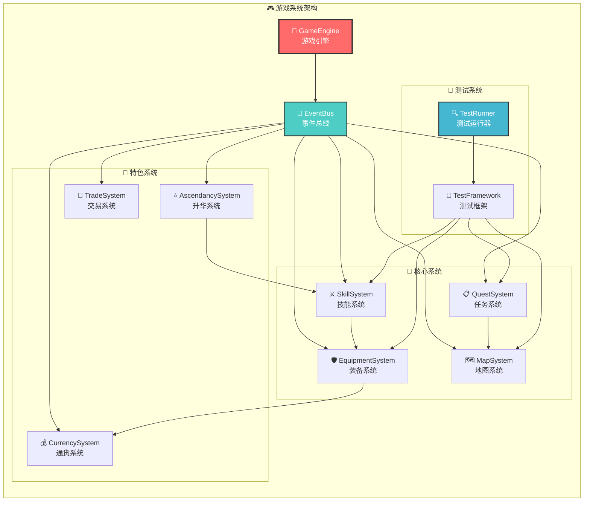

# 🏗️ 项目架构图表

本文档包含了流放ARPG框架项目的核心架构图表，用于直观展示系统设计和组件关系。

## 📋 目录

1. [分层架构图](#分层架构图)
2. [系统交互图](#系统交互图)
3. [架构说明](#架构说明)

## 🏛️ 分层架构图

以下图表展示了项目的分层架构设计，基于DDD(领域驱动设计)模式：

```mermaid
graph TD
    A["🎮 流放ARPG框架<br/>游戏开发框架"] --> B["📱 表现层<br/>(Presentation)"]
    A --> C["🎯 应用层<br/>(Application)"]
    A --> D["🏛️ 领域层<br/>(Domain)"]
    A --> E["🔧 基础设施层<br/>(Infrastructure)"]
    A --> F["⚙️ 核心层<br/>(Core)"]

    B --> B1["Vue组件<br/>用户界面"]
    B --> B2["Phaser场景<br/>游戏渲染"]

    C --> C1["GameApplication<br/>应用控制器"]
    C --> C2["SceneManager<br/>场景管理"]
    C --> C3["InputManager<br/>输入处理"]

    D --> D1["Character<br/>角色系统"]
    D --> D2["Combat<br/>战斗系统"]
    D --> D3["Equipment<br/>装备系统"]
    D --> D4["Quest<br/>任务系统"]
    D --> D5["Currency<br/>通货系统"]

    E --> E1["EventBus<br/>事件总线"]
    E --> E2["StateManager<br/>状态管理"]
    E --> E3["ConfigManager<br/>配置管理"]

    F --> F1["GameEngine<br/>游戏引擎"]
    F --> F2["Math<br/>数学工具"]
    F --> F3["Interfaces<br/>核心接口"]

    style A fill:#ff6b6b,stroke:#333,stroke-width:3px,color:#fff
    style B fill:#4ecdc4,stroke:#333,stroke-width:2px,color:#fff
    style C fill:#45b7d1,stroke:#333,stroke-width:2px,color:#fff
    style D fill:#96ceb4,stroke:#333,stroke-width:2px,color:#fff
    style E fill:#feca57,stroke:#333,stroke-width:2px,color:#fff
    style F fill:#ff9ff3,stroke:#333,stroke-width:2px,color:#fff
```

### 分层说明

| 层级 | 职责 | 主要组件 |
|------|------|----------|
| 🎮 **核心框架** | 整体架构协调 | 游戏引擎、事件系统 |
| 📱 **表现层** | 用户界面和渲染 | Vue组件、Phaser场景 |
| 🎯 **应用层** | 业务流程编排 | 场景管理、输入处理 |
| 🏛️ **领域层** | 业务逻辑核心 | 角色、战斗、装备系统 |
| 🔧 **基础设施层** | 底层服务支持 | 事件总线、状态管理 |
| ⚙️ **核心层** | 框架无关组件 | 数学工具、接口定义 |

## 🔄 系统交互图

以下图表展示了各个游戏系统之间的交互关系和依赖结构：

### 系统交互说明

#### 🎯 核心控制层
- **GameEngine**: 游戏引擎作为总控制器，管理所有系统的生命周期
- **EventBus**: 事件总线提供系统间的解耦通信机制

#### 🎲 核心游戏系统
- **SkillSystem**: 技能系统管理所有技能逻辑和效果
- **EquipmentSystem**: 装备系统处理装备穿戴和属性计算
- **MapSystem**: 地图系统负责场景管理和区域控制
- **QuestSystem**: 任务系统管理任务流程和奖励发放

#### 🎨 特色功能系统
- **CurrencySystem**: 通货系统实现物品交换经济
- **AscendancySystem**: 升华系统提供职业进阶功能
- **TradeSystem**: 交易系统支持玩家间物品交换

#### 🧪 质量保证系统
- **TestRunner**: 测试运行器执行所有自动化测试
- **TestFramework**: 测试框架提供测试基础设施

## 📊 架构优势

### 🔧 技术优势

1. **分层清晰**: 每层职责明确，便于维护和扩展
2. **事件驱动**: 基于EventBus的解耦设计，提高系统灵活性
3. **模块化**: 高内聚低耦合的模块设计，支持并行开发
4. **类型安全**: TypeScript提供编译时类型检查
5. **测试完整**: 100%测试覆盖率，确保代码质量

### 🎮 游戏特色

1. **高度可配置**: 所有游戏机制通过JSON配置文件驱动
2. **多样化系统**: 丰富的游戏系统支持复杂的游戏玩法
3. **扩展性强**: 易于添加新的游戏系统和功能
4. **性能优化**: 事件驱动架构避免不必要的轮询
5. **跨平台**: 支持Web和桌面应用部署

### 🚀 开发效率

1. **快速迭代**: 配置驱动的设计支持快速功能调整
2. **团队协作**: 清晰的架构边界便于团队分工
3. **质量保证**: 完整的测试体系确保代码稳定性
4. **文档完善**: 详细的架构文档降低学习成本

## 🔄 架构演进

### 当前版本特点
- ✅ 基础架构完善
- ✅ 核心系统实现
- ✅ 测试体系建立
- ✅ 文档体系完整

### 未来扩展方向
- 🔄 性能优化和内存管理
- 🔄 多人游戏支持
- 🔄 更多游戏内容和系统
- 🔄 移动端适配
- 🔄 云存档和同步

## 📝 使用说明

### 查看架构图
1. 在支持Mermaid的Markdown编辑器中打开本文档
2. 或者使用GitHub、GitLab等平台的在线预览功能
3. 也可以使用Mermaid Live Editor在线渲染

### 更新架构图
1. 修改对应的Mermaid图表代码
2. 确保图表语法正确
3. 更新相关的说明文档
4. 提交变更并更新版本

---

*本文档随项目架构演进持续更新，最后更新时间: 2024年* 